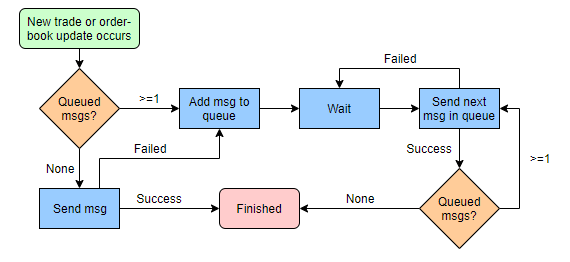

# Contributions API

## Document history

|Version|Date|Comments|
|---|---|---|
|1|09/11/2018|First public version|
|1.1|12/11/2018|Update to use POST payload, added examples|
|1.2|15/11/2018|Review changes, additional product endpoint added|
|1.3|23/11/2018|TU and OB endpoints now multiple payloads per call. Can also request last trade data|
|1.4|10/12/2018|Added snapshot option to OB endpoint|
|1.5|31/01/2019|Orderbooks can now be cleared down via snapshot|
|1.5a|04/02/2019|Clarified orderbook and trade ID requirements|
|1.5b|18/03/2019|Further clarified requirements|

## Introduction
Contributing Crypto market data to CryptoCompare is now supported via our Contributor API. Each contributor is required to have an APIKey before beginning contributions.

Both trade and orderbook updates are supported via REST endpoints documented below. Whilst real-time incremental orderbook data is optional, periodic snapshots are required as well as complete tick by tick trade data (with unique trade IDs). 

Incrementing trade IDs are preferred, however contributions of UUIDs are also supported provided each trade is uniquely identifiable. Orderbook data can be contributed either in a raw (i.e. when any change occurs) or conflated (combined changes within each second) formats.

Additionally, information about contributed assets can be provided by our Product endpoint.

### Requirements for integration

Depending on the type of contributions, the following constitute the minimum requirements for a successful integration. It is for the contributor to decide whether they send trades with orderbook snapshots or orderbook snapshots followed by incremental updates. Simply providing regular snapshots may be easier to implement but will result in greater traffic between the contributing system and CryptoCompare infrastructure. As such, full trades and snapshots coupled with orderbook data is preferred but not a requirement for a successful integration.

#### Communication ####
You can contact us by using the contact forms on https://www.cryptocompare.com our support staff will then connect you to the right teams. We use email as our primary method of communication, please be aware that we will only reach out to you from an email ending in @cryptocompare.com we do not use any other domain for sending emails.
Our second channel of communication is our slack workspace. If you need an invite, do not hesitate to contact us, using the contact form on our website and our support team will start the process of getting you on our slack.

#### General requirements

* Orderbook position values and trade prices priced in the TO symbol (i.e. USD for BTC-USD, see example below)
* No duplication of trades or trade IDs (trade IDs can be sequential or UUID but each trade must be uniquely identified)
* Trades must be sent in order both within a contributions message and between messages
* All timestamps must be in UTC

#### Trades and orderbook snapshot

* Full tick by tick trade data (either per tick or combined in a single contribution, we require trades to be sent within 15 seconds of the actual transaction time)
* Orderbook snapshots at least every 60 seconds for each market

#### Trades and full orderbook data

* Full tick by tick trade data (either per tick or combined in a single contribution, we require trades to be sent within 15 seconds of the actual transaction time)
* Orderbook snapshots must be sent at least every 10 minutes with incremental updates being sent at least every 10 seconds (where there is an update to the orderbook) for each market

### Example contributions flow
Contributed messages should have contiguous incrementing sequence (and trade IDs for trade updates) with a rate not greater than the defined rate limit.

A typical contributions session might look like the following:
<table>
      <tr>
         <th>Event</th>
         <th>Action</th>
         <th>Example endpoint call</th>
      </tr>
      <tr>
         <td rowspan=2><strong>Start of contributions</strong> for coin pair or instrument</td>
         <td>
            <p>Initial snapshot of order-book should be sent</p>
         </td>
         <td>
            <p>https://contributions.cryptocompare.com/v1/ob</p>
            <pre>{
    "apikey":"XYZ-ABC-DEF",
    "ob":
    [
        {
            "fsym":"BTC",
            "tsym":"USD",
            "timestamp":1539788400000,
            "bids":[["100.0","10"],["101.0","10"],["102.0","10"]], 
            "asks":[["125.0","20"],["128.0","20"],["130.0","20"]],
            "snapshot":"true"
        }
    ]
}</pre>
         </td>
      </tr>
      <tr>
         <td>Last trade to occur before contribution began should be sent</td>
         <td>
            <p>https://contributions.cryptocompare.com/v1/tu</p>
            <pre>{
    "apikey": "XYZ-ABC-DEF",
    "tu":
    [
        {
            "fsym":"BTC",
            "tsym":"USD",
            "price":"102.1",
            "volume":"1.5",
            "timestamp":1539788400000,
            "tradeid":1000,
            "type":"buy"
        }
    ]
}</pre>
         </td>
      </tr>
      <tr>
         <td rowspan=2>
            <p><strong>Trade occurs</strong></p>
            <p>e.g. BUY @ 102.0 of 1 unit</p>
         </td>
         <td>Trade update to be sent</td>
         <td>
            <p>https://contributions.cryptocompare.com/v1/tu</p>
            <pre>{
    "apikey": "XYZ-ABC-DEF",
    "tu":
    [
        {
            "fsym":"BTC",
            "tsym":"USD",
            "price":"102.0",
            "volume":"1",
            "timestamp":1539788500000,
            "tradeid":1001,
            "type":"buy"
        }
    ]
}</pre>
         </td>
      </tr>
      <tr>
         <td>
            <p>Order-book update to be sent</p>
         </td>
         <td>
            <p>https://contributions.cryptocompare.com/v1/ob</p>
            <pre>{
    "apikey":"XYZ-ABC-DEF",
    "ob":
    [
        {
            "fsym":"BTC",
            "tsym":"USD",
            "timestamp":1539788500000,
            "bids":[["102.0","9"]], 
        }
    ]
}</pre>
         </td>
      </tr>
      <tr>
         <td><strong>Order-book</strong> update(s) occur</td>
         <td>
            <p>Order-book update(s) to be sent</p>
         </td>
         <td>
            <p>https://contributions.cryptocompare.com/v1/ob</p>
            <pre>{
    "apikey":"XYZ-ABC-DEF",
    "ob":
    [
        {
            "fsym":"BTC",
            "tsym":"USD",
            "timestamp":1539788600000,
            "bids":[["102.0","12"]],
            "asks":[["128.0","0"]]
        }
    ]
}</pre>
         </td>
      </tr>
      <tr>
         <td rowspan=2>
            <p><strong>Trade occurs</strong></p>
            <p>e.g. SELL @ 102.5 of 5 units</p>
         </td>
         <td>Trade update to be sent</td>
         <td>
            <p>https://contributions.cryptocompare.com/v1/tu</p>
            <pre>{
    "apikey": "XYZ-ABC-DEF",
    "tu":
    [
        {
            "fsym":"BTC",
            "tsym":"USD",
            "price":"125.0",
            "volume":"5",
            "timestamp":1539788700000,
            "tradeid":1002,
            "type":"sell"
        }
    ]
}</pre>
         </td>
      </tr>
      <tr>
         <td>
            <p>Order-book update to be sent</p>
         </td>
         <td>
            <p>https://contributions.cryptocompare.com/v1/ob</p>
            <pre>{
    "apikey":"XYZ-ABC-DEF",
    "ob":
    [
        {
            "fsym":"BTC",
            "tsym":"USD",
            "timestamp":1539788700000,
            "asks":[["125.0","15"]]
        }
   ]
}</pre>
         </td>
      </tr>
</table>

## Endpoints
The following endpoints are supported

|End point|Path|Notes|
|---|---|---|
|Trade update|/v1/tu|Used for pushing new TRADE information|
|Order book|/v1/ob|Used to pushing current order book snapshot and incremental updates|
|Product|/v1/prod|Instrument identification list|
|Last Trade|/v1/last|Obtain last trade info|

Contributed JSON must be sent as a body payload, not as a URL parameter.

## Trade update endpoint
Each trade that occurs for every contributed pair should be contributed via the trade update endpoint. The base object takes the contributor apikey followed by an array of trade updates. One or more trades can be sent per call, however each trade must have a unique tradeid and a later timestamp than any previously contributed trades.Supplied trades should be sorted within the tu array from earliest to latest.
<table>
    <tr>
        <th>Param</th>
        <th>Payload</th>
        <th>Example</th>
        <th>Required</th>
        <th>Notes</th>
    </tr>
    <tr>
        <td>apikey</td>
        <td>string</td>
        <td>XYZ-ABC-DEF</td>
        <td><strong>Yes</strong></td>
        <td><em>apikey </em>must be equal to or less than 100 characters</td>
    </tr>
    <tr>
        <td>tu</td>
        <td>Array of trade update payloads</td>
        <td>See definition and example below</td>
        <td><strong>Yes</strong></td>
        <td>At least one entry within the array is required</td>
    </tr>
</table>

### Trade update payload
<table>
    <tr>
        <th>Param</th>
        <th>Payload</th>
        <th>Example</th>
        <th>Required</th>
        <th>Notes</th>
    </tr>
    <tr>
        <td>fsym</td>
        <td>string</td>
        <td>BTC</td>
        <td><strong>Yes</strong></td>
        <td>fsym and tsym fields must be equal to or less than 20 characters</td>
    </tr>
    <tr>
        <td>tsym</td>
        <td>string</td>
        <td>USD</td>
        <td><strong>Yes</strong></td>
    </tr>
    <tr>
        <td>price</td>
        <td>string</td>
        <td>1000.123</td>
        <td><strong>Yes</strong></td>
        <td>Must be a valid decimal number encoded as an ASCII string
        Total length must be less than must be equal to or less than 20 characters.<br/><br/>
        Must be expressed in the <strong>FROM</strong> symbol units.</td>
    </tr>
    <tr>
        <td>volume</td>
        <td>string</td>
        <td>1000.123</td>
        <td><strong>Yes</strong></td>
        <td>Must be a valid decimal number encoded as an ASCII string
        Total length must be less than must be equal to or less than 20 characters.<br/><br/>
        Must be expressed in the <strong>FROM</strong> symbol units.</td>
    </tr>
    <tr>
        <td>timestamp</td>
        <td>integer</td>
        <td>1539788400000</td>
        <td><strong>Yes</strong></td>
        <td>Millisecond resolution unix time format in UTC at which trade occurred.
        Must be later than any previous timestamp contributed.</td>
    </tr>
    <tr>
        <td>tradeid</td>
        <td>integer</td>
        <td>123456</td>
        <td><strong>Yes</strong></td>
        <td>Incrementing, vendor specific unique identifier for each trade.</td>
    </tr>
    <tr>
        <td>type</td>
        <td>string</td>
        <td>buy</td>
        <td><strong>No</strong></td>
        <td>Only the following are accepted values:
        <ul>
            <li>buy</li>
            <li>sell</li>
            <li>unknown</li>
        </ul>
        </td>
    </tr>
</table>

An example contribution using a minimal python script would be as follows.
```
import requests,json

timestamp = 1539788400000

tradeUpdate1 = '{"price":"123.456", "volume":"100.001","fsym":"BTC", "tsym":"USD", "timestamp":' + str(timestamp) +', "tradeid":1001, "type":"buy"}'
tradeUpdate2 = '{"price":"223.456", "volume":"200.001","fsym":"BTC", "tsym":"GBP", "timestamp":' + str(timestamp) +', "tradeid":1002, "type":"sell"}'
tradeUpdatePayload = '{"apikey": "XYZ-ABC-DEF", "tu":[' + tradeUpdate1 + ',' + tradeUpdate2 + ']}'
jsonPayload = json.loads(tradeUpdatePayload)

r = requests.post("https://contributions.cryptocompare.com/v1/tu", json=jsonPayload )
print(r.status_code, r.reason)
print(r.text)
```
Note that the payload of a trade update is limited to 100,000 bytes.

## Order-book snapshot endpoint

Order book information can be contributed to CryptoCompare via this endpoint.

Order book integrations can either be via:

1. a snapshot at a regular interval (i.e. every 60 seconds) or 
2. by less frequent snapshots followed by smaller incremental updates

Whilst the first option is the simpler mechanism to implement it's not ideal both from a time lag and a bandwidth prospective. As such it's strongly encouraged contributors choose the second option.

Every call to the order book snapshot endpoint can contain multiple update payloads. Each of these payloads can either be treated as a **snapshot** or as an **update**. Snapshots are indicated by the snapshot parameter being sent with 'true' and cause and previous order book information stored for the associated fsym/tsym instrument pair to be discarded and replaced with the contents of the bids and asks fields. When beginning contributions or sending a periodic snapshot, use this snapshot field to ensure no previous order book positions are still stored.

If a position that was previously sent is removed, an update with a volume of 0 is expected.

Should a position move from bid to ask (or visa versa) an explicit remove is required by sending a 0 volume for the bid position and a new position volume within the ask category.

<table>
    <tr>
        <th>Param</th>
        <th>Payload</th>
        <th>Example</th>
        <th>Required</th>
        <th>Notes</th>
    </tr>
    <tr>
        <td>apikey</td>
        <td>string</td>
        <td>XYZ-ABC-DEF</td>
        <td><strong>Yes</strong></td>
        <td><em>apikey </em>must be equal to or less than 100 characters</td>
    </tr>
    <tr>
        <td>ob</td>
        <td>Array of Order-book update payloads</td>
        <td>See definition and example below</td>
        <td><strong>Yes</strong></td>
        <td>At least one entry within the array is required</td>
    </tr>
</table>

### Order-book update payload

<table>
    <tr>
        <th>Param</th>
        <th>Payload</th>
        <th>Example</th>
        <th>Required</th>
        <th>Notes</th>
    </tr>
    <tr>
        <td>fsym</td>
        <td>string</td>
        <td>BTC</td>
        <td><strong>Yes</strong></td>
        <td rowspan=2>fsym and tsym fields must be equal to or less than 20 characters</td>
    </tr>
    <tr>
        <td>tsym</td>
        <td>string</td>
        <td>USD</td>
        <td><strong>Yes</strong></td>
    </tr>
    <tr>
        <td>bids</td>
        <td>dictionary of [key,value] pairs</td>
        <td>See below</td>
        <td><strong>Yes</strong></td>
        <td rowspan=2>Either one pair is required for bids or asks. Both bids and asks can be supplied in the same message. If the update is a snapshot these fields are optional.<br/><br/>
        Values must be expressed in the FROM symbol units.
        See examples</td>
    </tr>
    <tr>
        <td>asks</td>
        <td>dictionary of [key,value] pairs</td>
        <td>see below</td>
        <td><strong>Yes</strong></td>
    </tr>
    <tr>
        <td>timestamp</td>
        <td>integer</td>
        <td>1539788400000</td>
        <td><strong>Yes</strong></td>
        <td>Time at which orderbook reflects changes sent</td>
    </tr>
    <tr>
        <td>snapshot</td>
        <td>string</td>
        <td>true</td>
        <td><strong>No</strong></td>
        <td>Optional value, should be set to 'true' or omitted entirely. Causes previous orderbook information to be dropped for this fsym/tsym pair</td>
    </tr>
</table>

```
"bids":[["100.0","10"],["101.0","10"],["102.0","10"]],
"asks":[["125.0","20"],["128.0","20],["130.0","20"]]
```
Dictionaries of bid and ask values follow the following the example above, formatted as ["price","volume"]. An orderbook update JSON object must have at least one bid or ask position. One exception to this rule is when clearing down an order-book. In this case it is acceptable to send blank bids and asks (or omit them entirely) as long as "snapshot" is sent as "true".

All values are absolute and a volume of 0 removes it from the order book.

An example contribution using a minimal python script would be as follows.

```
import requests, json

ts = 100000000000
obEntry1 = '{"fsym":"BTC", "tsym":"USD", "timestamp":' + str(ts) +', "bids":[["100","110"],["101","111"]], "asks":[["200","220"],["201","221"]]}'
obEntry2 = '{"fsym":"BTC", "tsym":"GBP", "timestamp":' + str(ts) +', "bids":[["400","410"],["401","411"]], "asks":[["500","520"],["501","521"]]}'

obJsonString = '{"apikey":"XYZ-ABC-DEF", "ob":[' + obEntry1 + ','+ obEntry2 +']}'
jsonPayload = json.loads(obJsonString)

r = requests.post("https://contributions.cryptocompare.com/v1/ob", json=jsonPayload)
print(r.status_code, r.reason)
print(r.text)
```
Note that the payload of an order-book update is limited to 1,000,000 bytes.

## Product endpoint

<table>
    <tr>
        <th>Param</th>
        <th>Payload</th>
        <th>Example</th>
        <th>Required</th>
        <th>Notes</th>
    </tr>
    <tr>
        <td>apikey</td>
        <td>string</td>
        <td>XYZ-ABC-DEF</td>
        <td><strong>Yes</strong></td>
        <td><em>apikey </em>must be equal to or less than 100 characters</td>
    </tr>
    <tr>
        <td>fsym</td>
        <td>dictionary of [key,value] pairs</td>
        <td>["BTC","Bitcoin"]</td>
        <td><strong>Yes</strong></td>
        <td rowspan=2>Either <em>fsym</em> or <em>tsym</em> must be populated with at least a single entry</td>
    </tr>
    <tr>
        <td>tsym</td>
        <td>dictionary of [key,value] pairs</td>
        <td>["USD","US Dollar"]</td>
        <td><strong>Yes</strong></td>
    </tr>
</table>

To supply information about the nature of each instrument that is contributed, the product endpoint can be used. Any updates to a particular fsym or tsym replace any others that may have been contributed. CryptoCompare do not assume that a ticker is the same for both fsym and tsym and any ticker used in both a fsym and a tsym must be individually defined.

**Please note the product endpoint is not presently available.**

An example contribution using a minimal python script would be as follows.
```
import requests
r = requests.post("https://contributions.cryptocompare.com/v1/prod", json={"apikey": "XYZ-ABC-DEF","fsyminfo":[["BTC","Bitcoin"]], "tsyminfo":[["USD","US Dollar"]]})
print(r.status_code, r.reason)
print(r.text)
```

## Last Trade endpoint

<table>
    <tr>
        <th>Param</th>
        <th>Payload</th>
        <th>Example</th>
        <th>Required</th>
        <th>Notes</th>
    </tr>
    <tr>
        <td>apikey</td>
        <td>string</td>
        <td>XYZ-ABC-DEF</td>
        <td><strong>Yes</strong></td>
        <td><em>apikey </em>must be equal to or less than 100 characters</td>
    </tr>
    <tr>
        <td>fsym</td>
        <td>string</td>
        <td>BTC</td>
        <td><strong>Yes</strong></td>
        <td rowspan=2>fsym and tsym fields must be equal to or less than 20 characters</td>
    </tr>
    <tr>
        <td>tsym</td>
        <td>string</td>
        <td>USD</td>
        <td><strong>Yes</strong></td>
    </tr>
</table>

This endpoint will return the most recent contributed data for a particular pair belonging to the API key. If no recent contribution exists, the requested pair will be echoed back without any further trade data.

An example contribution using a minimal python script would be as follows.
```
import requests
r = requests.post("https://contributions.cryptocompare.com/v1/last", json={"apikey":"XYZ-ABC-DEF","fsym":"BTC","tsym":"USD"})
print(r.status_code, r.reason)
print(r.text)
```

## Rate limit
Rate limiting is performed on a per API key basis, irrespective of end point or payload.

The present limit is 10 calls per second per API key. This is limit is enforced over a 60 second period, effectively restricting contributors to 600 messages per 60 second period.



Any contributions that are rejected should be queued and sent again after a suitable wait time has elapsed.

Rate limits reset every minute, so an ideal wait time on receiving a rate limit rejection would be 60 seconds.
